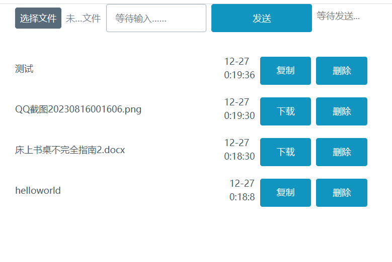

# 文件同步工具

## *by NoRain*

## 2023/12/24

为了解决多端同步的痛点,决定本地开启一个服务器.

### 使用方式

注意:基于node版本14.21.3,版本太低可能会导致报错.

初始化：

- 执行```npm install```初始化
- 执行```npm run build```构建
- 执行```npm run copy```复制网页和图标到对应位置

运行：

- 执行```npm run start```开启服务器
- 浏览器输入```你的IP:4100```打开网页

可能的错误:

- 数据库安装失败,多执行```npm install```几次试试.
- 第一次运行提示乱七八糟的,能运行就别管.

### version

|版本|说明|
|---|---|
|1.0.0|初版|
|1.1.0|修复重复上传文字bug，添加文件大小提示|
|1.2.0|添加夜间模式|
|1.3.0|添加当前页面二维码|

运行截图:


