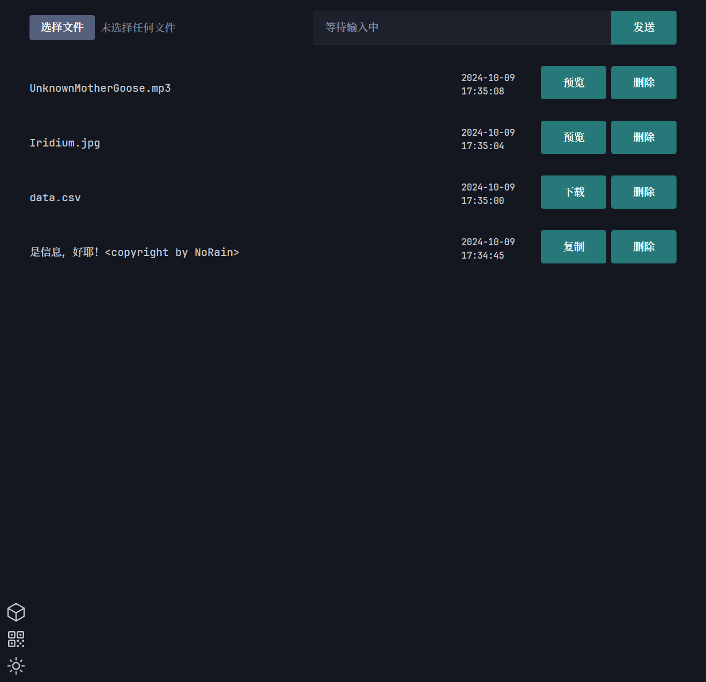

# 文件/文件同步工具

## *by NoRain*

## 2023/12/24

为了解决多端同步的痛点,决定本地开启一个服务器.

### 使用方式

注意:本人基于node版本16.16.0开发，版本太低可能会导致编译/运行报错。

初始化：

- 执行```pnpm install```初始化
- 执行```npm run copy```复制网页和图标到对应位置

构建：

- 执行```npm run build```构建，注意必须先执行copy，否则webpack会报错

开发：

- 执行```npm run watch```开启代码监听并且自动刷新服务器(网页修改需要手动刷新)

打包：

- 修改目录下的rcedit.js中的options配置
- 执行```npm run rcedit```修补.pkg-cache/v3.4/built-v14.20.0-win-x64的文件
- 复制粘贴built-v14.20.0-win-x64到C:\Users\你的用户名\.pkg-cache\v3.4目录下，如果没有，可以先执行一遍```npm run exec```
- 执行```npm run exec```打包成.exe可执行文件到exce目录下

运行：

- 执行```npm run debug```开启带```--trace-warnings```参数的服务器
- 根据运行窗口，网页输入 HttpServer 后面的IP地址。

dist文件目录说明：

实际运行的是client以及server目录下的JS代码，_temp文件只是为了webpack中转

可能的错误:

- 第一次运行提示乱七八糟的,能运行就别管.
- 数据库安装失败,多执行```npm install```几次试试，实在不行就下载[我打包好的文件](https://github.com/NoRainLand/filesync/releases/tag/untagged-effc87f7dee701d8da7f)，但是你解压之后还是要执行一次```npm install```（并且记得不要把package-lock.json，package.json两个文件给覆盖了），因为我后面有添加了新的库（主要是sqlite3库下载可能会出问题）
- 如果打包报错类似如下所示的话，可以参考[这里](https://segmentfault.com/a/1190000041958374),项目目录下提供了我下载好的文件。

```txt
[0] > pkg@5.8.1
[0] > Fetching base Node.js binaries to PKG_CACHE_PATH
[0] > Not found in remote cache:
[0]   {"tag":"v3.4","name":"node-v14.20.0-win-x64"}
[0] > Building base binary from source:
[0]   built-v14.20.0-win-x64
[0] > Fetching Node.js source archive from nodejs.org...
[0] > Error! AssertionError [ERR_ASSERTION]: The expression evaluated to a falsy value:
```

### 使用的开源库

node模组不在其内

[picocss](https://picocss.com/):用于语义化HTML的极简CSS框架. #强烈推荐，本应用的样式基本都是靠这个。

[vConsole](https://github.com/Tencent/vConsole):一个轻量、可拓展、针对手机网页的前端开发者调试面板。

[qrcodejs](https://github.com/davidshimjs/qrcodejs):QRCode.js是一个制作二维码的JS库. #还有别的选择么

[clipboard.js](https://github.com/zenorocha/clipboard.js):现代粘贴板复制，无需Flash，gzip压缩后只有3kb的JS库

[heroicons](https://heroicons.dev/):来自[@steveschoger](https://twitter.com/steveschoger)的基于MIT协议的开源图标库

### version

|版本|说明|
|---|---|
|1.0.0|初版|
|1.1.0|修复重复上传文字bug，添加文件大小提示|
|1.2.0|添加夜间模式|
|1.3.0|添加当前页面二维码|
|1.4.0|打包成exe|
|1.5.0|添加端口动态切换，防止端口被占用|
|1.6.0|修复打包之后无法下载文件的BUG|
|1.7.0|打开启动服务器之后默认浏览器，并且开放服务器配置，把启动改为串行操作|
|1.8.0|尝试添加断线重连机制，添加vconsole.min.js，可以在config配置打开|
|2.0.0|尝试修复手机浏览器切后台消息没同步BUG，添加欢迎语，统一数据格式|
|2.1.0|优化代码，大修|
|2.2.0|添加上传进度条，可配置显示的最小文件体积|
|2.3.0|接入clipboard.min.js|
|2.4.0|修复```npm run watch```BUG|
|3.0.0|完善打包流程，兼容浏览器不支持download属性|
|4.0.0|把npm包管理改为pnpm，请使用16.14版本及以上的node，添加webpack打包|

### 运行截图



**如果你喜欢这个项目，可以请我喝杯奶茶：**


